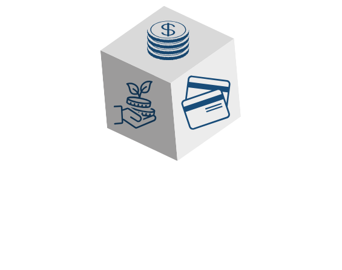
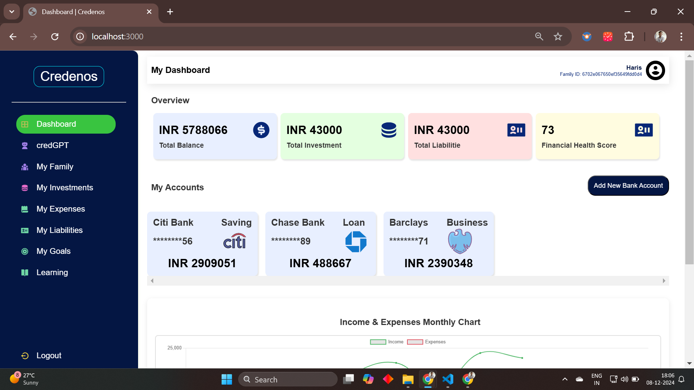
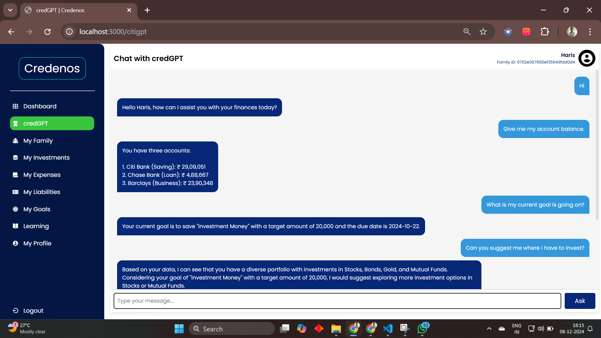
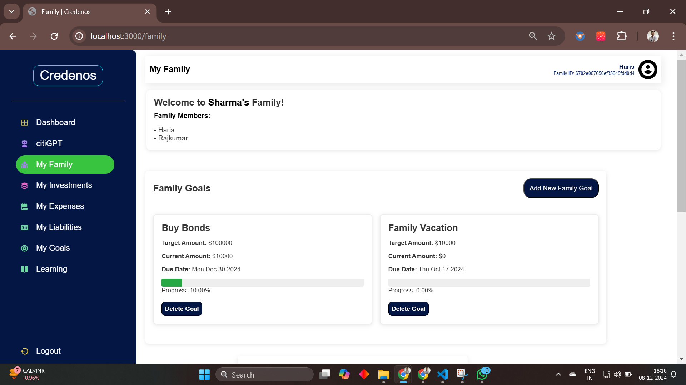
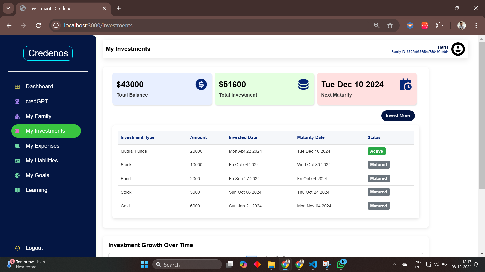
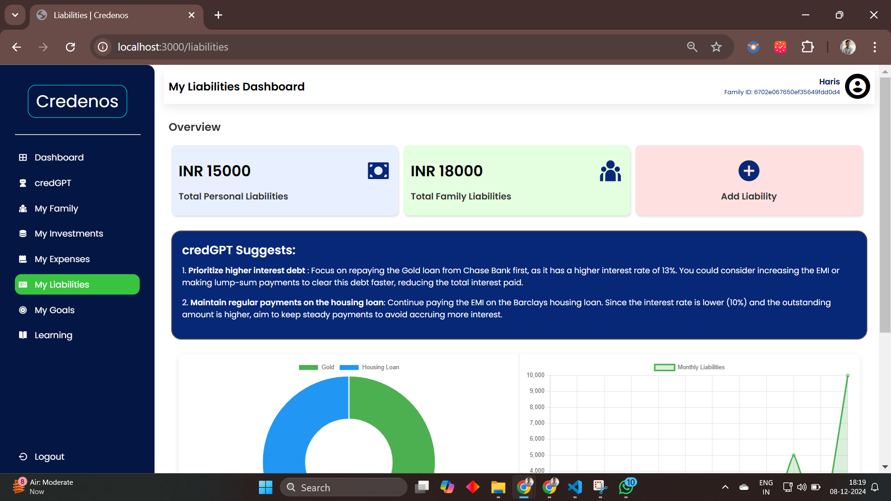

<!-- PROJECT LOGO -->
<div align="center">
    <!--  -->
    
  <h1 align="center"><b>Credenos: AI-Powered Companion for Smarter Financial Health and Family Wealth Management.</b></h1>

</div>

<!-- ABOUT THE PROJECT -->
<br>

## ♾️ Problem Statement

Develop ethical AI systems in banking, particularly for key areas like credit scoring, fraud detection, and personalized financial services, ensuring fairness and mitigating discrepancies among customers.

## ♾️ Solution

Credenos is an AI-powered finance companion designed to make managing personal and family finances easy, ethical, and inclusive. It provides personalized financial advice, tracks expenses and investments, and helps users set and achieve financial goals. With features like credGPT, users can ask questions about banking, get tailored investment suggestions, and learn about finance through gamified daily challenges and AI-generated learning paths. The platform offers clear visualizations for spending insights, family finance management, and dual scoring metrics like Credit Fitness and Financial Health scores to improve financial literacy. It’s an all-in-one app that promotes better financial habits, making it suitable for everyone, from young adults to retirees.

## ⚙️ Built With

The technologies and tools used are:

- LLM
- Langchain
- Groq
- Pinecone
- NLP
- HTML
- CSS
- Javascript
- Python
- NodeJS
- ExpressJS
- Bootstrap

<!-- GETTING STARTED -->

## 🧑‍💻 Getting Started

### Installation

1. Clone the repository

   ```sh
   git clone https://github.com/sanketdisale871/Squadron_Temethon.git
   ```

2. Install the dependencies:

   ```sh
   npm i
   ```

3. Start Application:
   ```sh
   nodemon index.js
   ```

<!-- CONTRIBUTING -->

## Some Glimpses of WorkConnect

- Dashboard
  

- credGPT
  

- My Family
  

- My Investments
  

- My Liabilities
  
